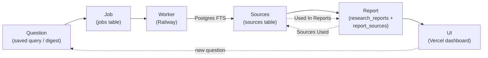

# System Overview

Research Knowledge Engine — Production Architecture

## Summary

The research knowledge engine is a multi-service platform for collecting, indexing, searching, and reporting on online research sources. It is deployed across three platforms:

| Platform | Role | Application |
|---|---|---|
| **Vercel** | UI + lightweight APIs | `apps/web` (Next.js) |
| **Supabase** | Database + Storage + Auth | `supabase/` |
| **Railway** | Background workers | `apps/worker` (Python) |

The core business logic lives in `packages/research_engine` and is shared between the worker and (in future) the web API.

---

## Components

### Vercel — UI + Lightweight APIs

`apps/web` is a Next.js application deployed to Vercel. It provides:

- A search interface for querying indexed sources
- A dashboard for browsing and managing sources, feeds, and reports
- Next.js API routes for search and report generation (lightweight, not CPU-intensive)
- Future: authentication flows via Supabase Auth

Vercel handles:
- Serverless function hosting for API routes
- Static asset CDN
- Preview deployments per pull request

### Supabase — Database + Storage + Auth

Supabase provides:

- **Postgres database** — persistent storage for all application data (sources, feeds, jobs, reports)
- **Storage** — raw HTML files, extracted text, PDFs
- **Auth** — user authentication and session management (Phase 5+)
- **Row Level Security** — data access control per authenticated user (Phase 5+)

The database schema is defined in `packages/db/schema/` and applied via `supabase/`.

### Railway — Background Workers

`apps/worker` is a Python process deployed to Railway. It:

- Polls the `jobs` table in Supabase for pending work
- Executes research engine tasks (RSS ingestion, URL import, indexing, report generation)
- Reports job status back to the database
- Runs continuously as a long-lived process (not serverless)

### Research Engine — Shared Business Logic

`packages/research_engine` is a Python package that contains all research logic:

- RSS feed fetching and parsing
- URL importing with trusted-site enforcement
- HTML text extraction (trafilatura + BeautifulSoup fallback)
- SQLite FTS5 indexing (Phase 1) / Postgres full-text search (Phase 2+)
- Search interface
- Markdown report generation

This package is imported by `apps/worker` and is the single source of truth for research processing logic.

---

## Data Flow

```
RSS Feeds / URLs
       │
       ▼
  apps/worker (Railway)
  ├── Fetches raw HTML
  ├── Extracts text via research_engine
  ├── Stores source metadata → Supabase (sources table)
  ├── Stores files → Supabase Storage
  └── Updates the search index
       │
       ▼
  Supabase Postgres
  ├── sources
  ├── feeds
  ├── jobs
  ├── research_reports
  └── source_tags
       │
       ▼
  apps/web (Vercel)
  ├── Search API route → queries Supabase
  ├── Report generation → calls research_engine via API
  └── Dashboard UI → displays results to user
```

---

## The Research Loop

The platform is a closed loop: a research **question** becomes a **job**, the
**worker** gathers **sources**, assembles a deterministic **report**, and the
**UI** surfaces it back to the user — with full source traceability in both
directions.



Key properties:

- **Deterministic** — reports and digests are assembled from stored metadata
  and verbatim excerpts ranked by Postgres `ts_rank`. There are **no LLMs,
  embeddings, vector databases, or external AI APIs** anywhere in the loop.
- **Traceable** — `report_sources` records which sources built each report
  (with `rank`), enabling the "Sources Used" panel on reports and the "Used In
  Reports" panel on sources.
- **Repeatable** — saved queries and weekly digests re-run the same
  search-and-assemble pipeline on a schedule or on demand.

---

## Shared Packages

| Package | Language | Purpose |
|---|---|---|
| `packages/research_engine` | Python | Core research business logic |
| `packages/db` | SQL | Database schema definitions |
| `packages/shared` | Python / TS | Cross-package models, constants, config |

---

## Phase 1 (Current State)

Phase 1 is a fully local, CLI-only system using:
- SQLite for storage
- Local filesystem for documents and exports
- Python CLI scripts in `apps/worker/scripts/`

No web UI, no cloud services, no authentication.

See `docs/roadmap/` for the full phased plan.
